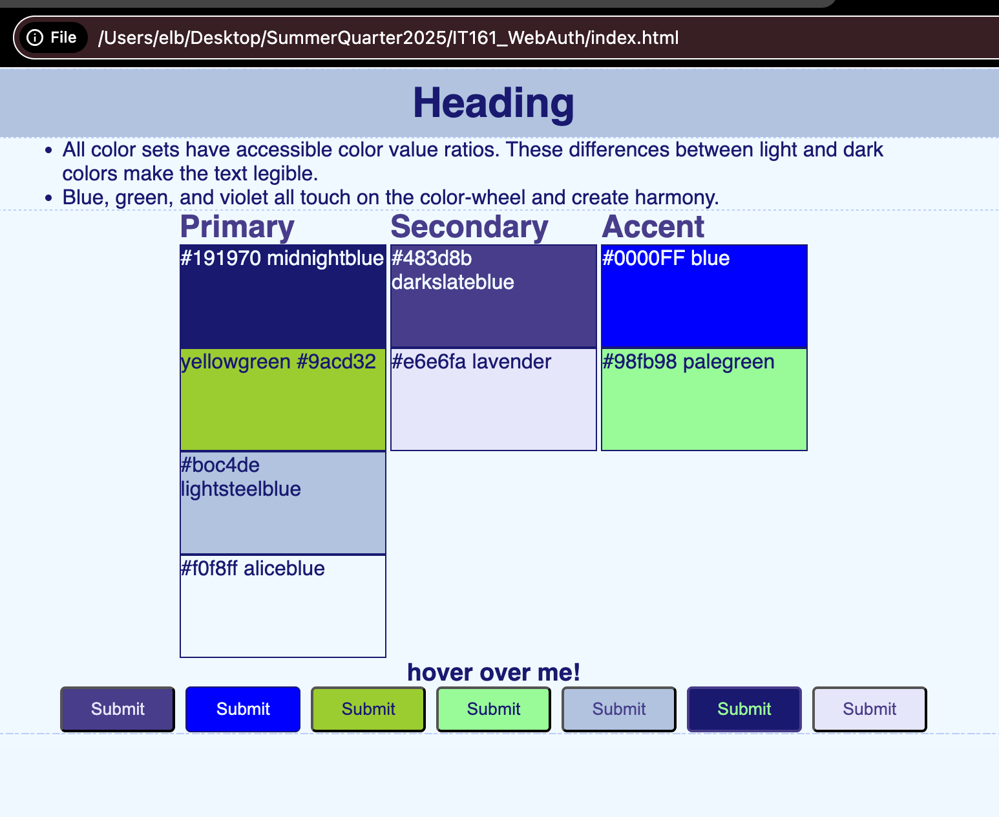

# Color Story

- This color palette is loosely based on North Seattle College website.
- To view the interactive app, navigate to the `color-story` directory inside `docs` and open `color.html` in your browser. To do this in windows command prompt you can enter `start color.html`. In mac, the terminal command is `open color.html`.
- All colors can be referenced in the `style.css` file by their hex code (#0000FF) or html name (blue).
- For interactivity ideas, all buttons have "hover" styling and show potential combinations that pass accessibility tests for visibility.
- Try to use the "Primary" colors the most, then the "Accent" colors will pop out more.

